<!-- markdownlint-disable MD024 MD033 MD041 -->

🌍 **[Web Page](https://imfsiddiqui.github.io/centinum)** | 💻 **[Source Code](https://github.com/imfsiddiqui/centinum)** | 🚀 **[Releases](https://github.com/imfsiddiqui/centinum/releases)**

# 🧠 centinum

A central configuration manager for multiple repositories, enabling unified settings, streamlined workflows, and simplified maintenance across projects.

  

## 📚 Table of Contents

- [🧠 centinum](#-centinum)
  - [📚 Table of Contents](#-table-of-contents)
  - [📌 About](#-about)
  - [🧘 Philosophy](#-philosophy)
  - [📄 Important Documents](#-important-documents)
  - [📜 License](#-license)

<a href="#top">☝️</a>

## 📌 About

centinum is a central configuration manager designed to streamline the management of multiple repositories. It provides a unified approach to settings, workflows, and maintenance, making it easier to manage development environments with consistent configurations.

<a href="#top">☝️</a>

## 🧘 Philosophy

The goal is to minimize setup friction and maximize productivity by automating the repetitive aspects of development environments configuration management.

<a href="#top">☝️</a>

## 📄 Important Documents

- [Changelog](https://github.com/imfsiddiqui/centinum/blob/main/docs/CHANGELOG.md): Changelog of all notable changes.
- [Code of Conduct](https://github.com/imfsiddiqui/centinum/blob/main/docs/CODE-OF-CONDUCT.md): Code of Conduct for contributors.
- [Commit Message Instructions](https://github.com/imfsiddiqui/centinum/blob/main/.github/copilot/commit-message-instructions.md): Commit message guidelines for contributors and Copilot.
- [Contribution Guidelines](https://github.com/imfsiddiqui/centinum/blob/main/docs/CONTRIBUTING.md): How to contribute to this project.
- [License](https://github.com/imfsiddiqui/centinum/blob/main/LICENSE.md): License text.
- [Pull Request Description Instructions](https://github.com/imfsiddiqui/centinum/blob/main/.github/copilot/pull-request-description-instructions.md): Pull request guidelines for contributors and Copilot.
- [Roadmap](https://github.com/imfsiddiqui/centinum/blob/main/docs/ROADMAP.md): High-level strategic plan, long-term goals, milestones, and overall project vision.
- [Security Policy](https://github.com/imfsiddiqui/centinum/blob/main/docs/SECURITY.md): Security policy and reporting instructions.
- [Todo](https://github.com/imfsiddiqui/centinum/blob/main/docs/TODO.md): Day-to-day task tracking and immediate execution.

<a href="#top">☝️</a>

## 📜 License

This project is licensed under the [MIT License](https://github.com/imfsiddiqui/centinum/blob/main/LICENSE.md), allowing anyone to use, modify, and distribute it freely for personal or commercial purposes.

<a href="#top">☝️</a>

